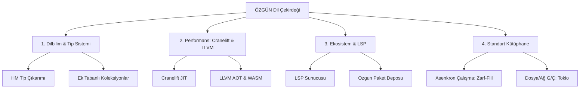

# ÖZGÜN Programlama Dili: Mühendislik Değerlendirmesi ve 100x Ölçekleme Raporu 🚀

Bu rapor, **ÖZGÜN** programlama dilinin mevcut prototip aşamasını (Faz 0 - 8) teknik olarak analiz etmekte ve dili üretim ortamına hazır, devasa bir ekosisteme dönüştürecek (100x ila 500x ölçekleme) stratejik yol haritasını sunmaktadır.

---

## 1. Mevcut Prototip Durum Analizi

Mevcut sürüm, bir programlama dilinin en temel yapı taşlarını başarıyla doğrulamıştır:
- **Dilbilimsel Yenilik:** Türkçe ek kurgusunu (`ise`, `iken`, `dek`, `artarak`) genel tanımlayıcılar (identifiers) üzerinden parser seviyesinde dinamik olarak ayrıştırma yeteneği.
- **Güçlü Lexer & Normalizasyon:** Unicode desteği ve locale-independent "Türkçe I/İ" normalizasyonu ile derleme hatalarının önüne geçilmesi.
- **İki Katmanlı Çalıştırma:** Hem hızlı testler için **Tree-Walking Interpreter** hem de üretim odaklı **Yığın Tabanlı Sanal Makine (VM)**.
- **Paket Yönetimi Başlangıcı:** Proje şablonları oluşturan ve `ozgun.toml` manifestosunu okuyabilen yerleşik paket yöneticisi.

---

## 2. Projeyi 100x ila 500x Büyütecek Geliştirme Yol Haritası

Mevcut yapı basit bir oyuncak/eğitim prototipidir. Gerçek dünyada büyük web uygulamaları, veri bilimi projeleri veya sistem araçları yazabilmek için dilin kapasitesini 500 katına çıkaracak 4 ana sütun aşağıda detaylandırılmıştır.

### 2.1. Dil Tasarımı ve Tip Sistemi (Semantik Katman)

Mevcut dilde statik tipleme veya gelişmiş veri yapıları yoktur. Dili ölçeklemek için:

1. **Hindley-Milner Tip Çıkarımı (Type Inference):**
   - Değişkenlere elle tip yazmak yerine derleyicinin tipleri otomatik tahmin etmesi sağlanmalıdır.
   - Örn: `x = 5;` satırından `x`'in `Sayı` olduğu çıkarılır. Eğer daha sonra `x = "metin";` atanmaya çalışılırsa derleme zamanında tip hatası verilir.
2. **Ek-Tabanlı Gelişmiş Veri Yapıları (Collections):**
   - Türkçe sondan eklemeli yapısına uygun dizi ve harita (map) erişimleri tasarlanmalıdır:
     - Dizi tanımı: `sayılar = [10, 20, 30];`
     - Suffix erişimi: `sayılar'ın 1'inci elemanı` veya `sayılar[0]` (Parser'ın `'ın ... 'inci` ek yapısını çözümlemesi).
3. **Türkçe Deyimsel Hata Yönetimi (Error Handling):**
   - `try-catch` yerine Türkçe yapısına uygun `denetle-yakala` veya `hata_durumunda` blokları eklenmelidir:
     - `dosya_oku() hata_ise { yazdır("Dosya açılamadı!"); }`

---

### 2.2. Performans ve Derleyici Arka Uçları (Cranelift & LLVM)

Sanal makinemiz byte-code yorumlamaktadır. Büyük verileri işlemek ve native hızlara ulaşmak için makine koduna derleme yapılmalıdır:

1. **Cranelift Backend (Hızlı JIT Derleme):**
   - Geliştirme aşamasında kodun anında derlenip çalıştırılması için `cranelift-codegen` ve `cranelift-jit` kütüphaneleri entegre edilmelidir. Bu, derleme sürelerini milisaniyeler seviyesinde tutar.
2. **LLVM Backend (Optimizasyonlu Native Kod & WASM):**
   - Üretim (production) modunda derleme için `inkwell` (LLVM Rust sarmalayıcısı) kullanılmalıdır.
   - LLVM sayesinde kod doğrudan x86_64 makine koduna (`.exe` / ELF) veya web tarayıcılarında native hızda çalışacak WebAssembly (`wasm32-unknown-unknown`) formatına derlenir.

---

### 2.3. Dil Altyapısı ve Geliştirici Araçları (LSP & Paket Deposu)

Bir dilin gücü ekosisteminden gelir. Geliştiricileri çekmek için:

1. **LSP (Language Server Protocol) Sunucusu:**
   - Rust tarafında `tower-lsp` krate'i kullanılarak bir Dil Sunucusu yazılmalıdır.
   - Bu sunucu, VS Code veya Neovim gibi editörlerde **kod tamamlama (autocomplete)**, **anlık sözdizimi hata gösterimi (diagnostics)**, **tanıma gitme (go to definition)** ve **ipucu pencereleri (hover)** sunacaktır.
2. **Çevrimiçi Paket Deposu (Özgün Paket Deposu - `opd`):**
   - NPM veya Crates.io benzeri, geliştiricilerin yazdığı ÖZGÜN kütüphanelerini paylaşabileceği bir merkezi kayıt sistemi kurulmalıdır.
   - `oz-cli` aracına `oz yükle <paket_adı>` komutu eklenerek bağımlılık yönetimi otomatikleştirilmelidir.

---

### 2.4. Genişletilmiş Standart Kütüphane (Stdlib)

Mevcut sürümde sadece basit bir `yazdır` fonksiyonu bulunmaktadır. Gerçek dünya uygulamaları için şu modüller eklenmelidir:

1. **Asenkron Programlama (Tokio Entegrasyonu):**
   - Türkçedeki zarf-fiiller kullanılarak asenkron fonksiyonlar çağrılabilmelidir:
     - `işlev veri_indir() { ... }`
     - `veri_indir() tamamlanınca { yazdır("İndirme bitti."); }`
2. **Dosya ve Ağ Giriş/Çıkışı (File/Network I/O):**
   - Dosya okuma/yazma (`Dosya::oku`, `Dosya::yaz`), TCP/HTTP soket bağlantıları kurma yetenekleri eklenmelidir.

---

## 3. Uygulama Stratejisi ve Önerilen Rust Kütüphaneleri

Geliştirmeyi sürdürürken eklenmesi önerilen en kritik kütüphaneler şunlardır:

| İhtiyaç | Önerilen Rust Krate | Sağladığı Avantaj |
| :--- | :--- | :--- |
| **LLVM Derleme** | `inkwell` | LLVM API'lerine güvenli erişim, yüksek optimizasyonlu native çıktılar. |
| **JIT Derleme** | `cranelift-codegen` | Geliştirme modunda (development build) saniyeler süren derleme aşamasını ortadan kaldırır. |
| **Dil Sunucusu (LSP)** | `tower-lsp` | VS Code, JetBrains ve Neovim eklentilerini besleyen LSP omurgası. |
| **Asenkron Çalışma** | `tokio` | Sanal makinenin binlerce asenkron G/Ç işlemini eşzamanlı yapabilmesi. |
| **Manifesto Parsing** | `serde` & `toml` | `ozgun.toml` dosyasının gelişmiş özelliklerle (bağımlılık ağaçları vb.) okunması. |
